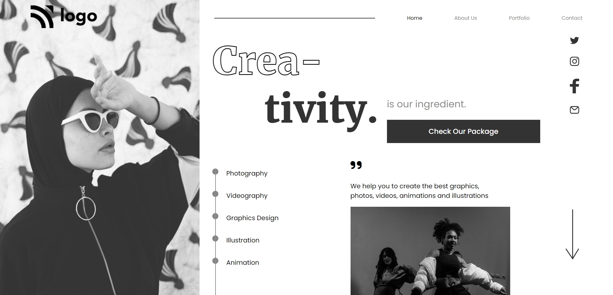

# Dance Home Page

This project is a Dance Landing Webpage which is created by using HTML and CSS. It's fully responsive.

## Authors

 >Manish Kumar

## What I learnt while creating this project

- Learnt about Media Queries
- Learnt CSS Grid and Flexbox
- Learnt about CSS Positioning.

## Honest Time to Finish Project

3 hours

# Netlify Link

[Project - 14](https://project-14-mk.netlify.app/)

# Thumbnail

